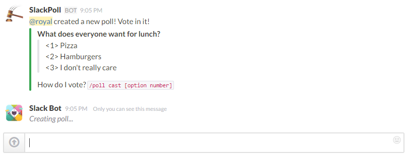
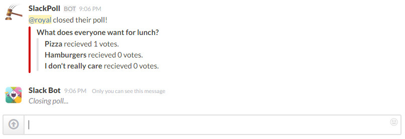

# SlackPoll
Add a basic polling integration to slack channels. It currently allows for one poll per channel at a given time.

--- 

### Command quick reference

| *Command*   | *Description* |
|------------|-----------------|
| `/poll create [question] options [options]` |  Create a poll in the channel. Delineated by a triple dash |
| `/poll cast [option number]` | Cast a vote for a specific option | 
| `/poll count` | Get the total number of votes cast so far | 
| `/poll close` | Close a poll and get the results |

--

### Start a poll

The basic syntax is `/poll create [Question] options [options]`, where the timeout is an optional field and the options are delineated by a triple dash `---`. During poll creation the person who started the poll is identified, so if you would like to start a new poll contact the other user and get them to close theirs.

An example of asking the team what you should do for lunch could be like this.

`/poll create What should we get for lunch? options Burgers --- Pizza --- Seafood`

--

### Casting a vote

Casting a vote is as easy as `/poll cast [option number]`. Each person is only allowed to vote once. Voting more than once will just change your vote to whatever you voted for last.

--

### How many people have voted in my poll?

If you would like to see how many votes there have been in the current poll just run `/poll count`.

--

### Closing a poll

Closing a poll is simple but it is limited to the person that started the poll. To close a poll simply run `/poll close` in the channel that you started your poll in. The results of your poll will then be posted with 

---

### Installation Instructions

Click on the button to deploy the application in Bluemix. This will create an application and a cloudant cluster that the application will connect to. 

Once you have the application up and running in bluemix, you will need to add two slack integrations. One slash command and one incoming webhook. 

Point the slash command to the URL provided by the bluemix application, and copy down the token. Grab the incoming webhook url from it's integration. 

Run `/poll register [incoming-webhook-url] [slash-command-token]` in your slack channel to register your slack account with the application.

You should be good to go at that point :)
